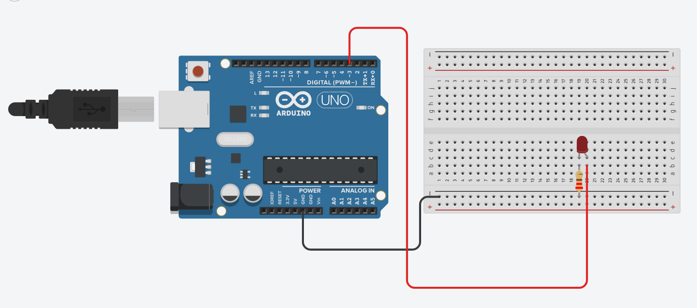

# 💡 LED Blink

Basic Arduino LED blinking project.

---

## ✨ Features
* Digital output
* Timing control
* Beginner embedded programming

---

## 🛠️ Hardware
* Arduino board
* LED
* Resistor

---

## 📸 Documentation
* `sketch.ino` → [Source Code](./sketch.ino)
* `tinkercad.png` → Circuit Schematic

  

---

## 📊 Status
* ✅ Physically built
* ✅ Tested
