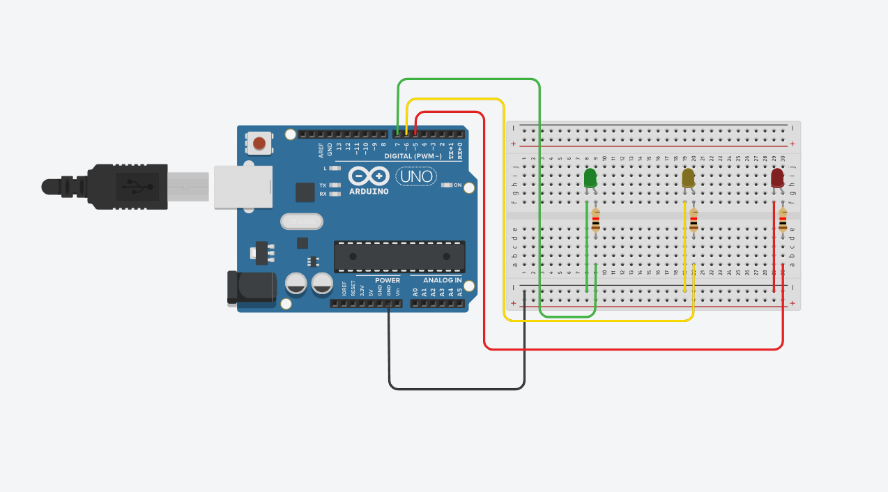

# 💡 Traffic Light

Traffic light simulation using multiple LEDs.

---

## ✨ Features
* Sequential logic
* LED state management
* Timing synchronization

---

## 🛠️ Hardware
* Arduino board
* Red LED
* Yellow LED
* Green LED
* Resistors

---

## 📸 Documentation
* `sketch.ino` → [Source Code](./sketch.ino)
* `tinkercad.png` → Circuit Schematic

  

---

## 📊 Status
* ✅ Physically built
* ✅ Tested
