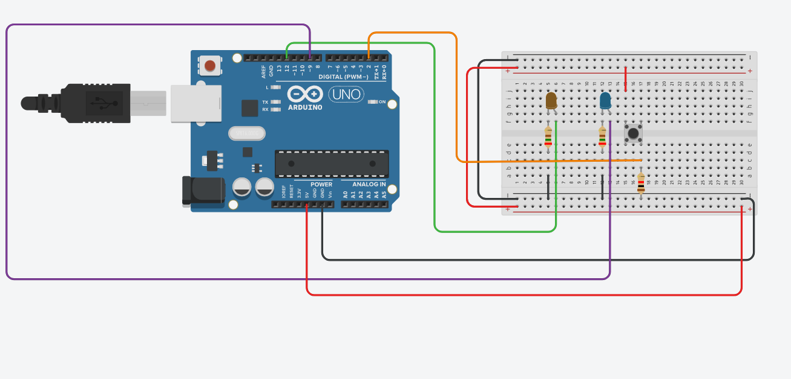

# 🔘 Button Controlled LEDs

Interactive LED control using a push button.

---

## ✨ Features
* Push-button input
* Dual LED state switching
* OFF state activates LED 1
* ON state activates LED 2

---

## 🛠️ Hardware
* Arduino board
* Push button
* Two LEDs
* Resistors

---

## 📸 Documentation
* `sketch.ino` → [Source Code](./sketch.ino)
* `tinkercad.png` → Circuit Schematic

  

---

## 📊 Status
* ✅ Physically built
* ✅ Tested
