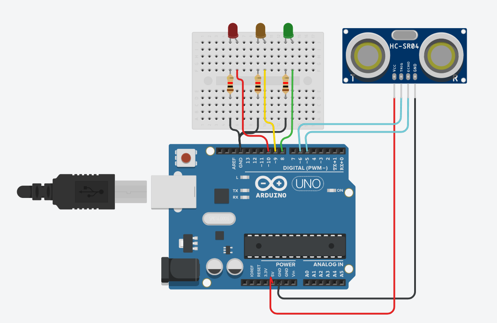

# 📏 Distance Reactive LEDs

Ultrasonic distance monitoring system with visual LED feedback.

---

## ✨ Features
* Real-time distance measurement
* LED activation based on object distance
* Sensor-driven visual feedback

---

## 🛠️ Hardware
* Arduino board
* Ultrasonic sensor
* LEDs
* Resistors

---

## 📸 Documentation
* `sketch.ino` → [Source Code](./sketch.ino)
* `tinkercad.png` → Circuit Schematic

  

---

## 📊 Status
* ✅ Physically built
* ✅ Tested
