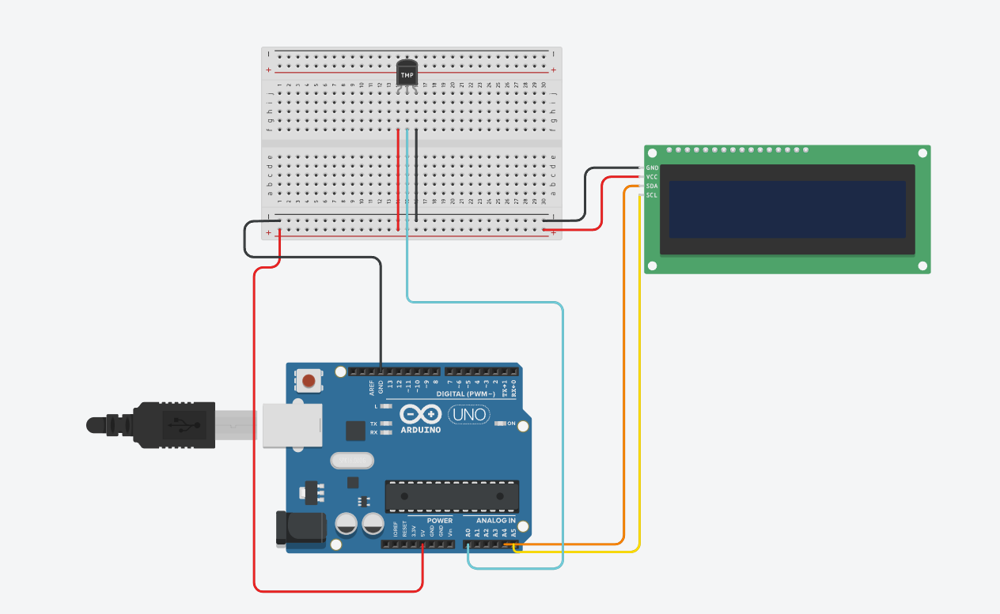

# 🌡️ Temperature Sensor Display
Temperature monitoring system with real-time display output.

## ✨ Features
* **Analog temperature reading**: Input processing from the sensor.
* **Data conversion**: Raw value translation to temperature.
* **Real-time LCD visualization**: Live data output on the screen.

## 🛠️ Hardware
* Arduino board
* Temperature sensor
* LCD display

## 📸 Documentation 
* `sketch.ino` → [Source Code](./sketch.ino)
* `tinkercad.png` → Circuit Schematic

  

## 📊 Status
* 🧪 Simulation only
