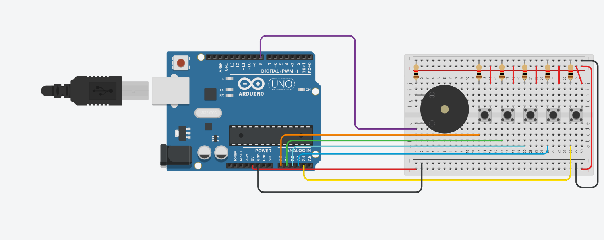

# 🎵 Interactive Musical Device
Interactive sound generation system using buttons and buzzer.

## ✨ Features
* **Push-button input**: Digital reading of button presses.
* **Tone generation**: Audio frequency output management.
* **Interactive note selection**: Button mapping to musical notes.
* **Real-time audio feedback**: Instant response to user interaction.

## 🛠️ Hardware
* Arduino board
* Push buttons
* Piezo buzzer

## 📸 Documentation
* `sketch.ino` → [Source Code](./sketch.ino)
* `tinkercad.png` → Circuit Schematic

  

## 📊 Status
* 🧪 Simulation only
